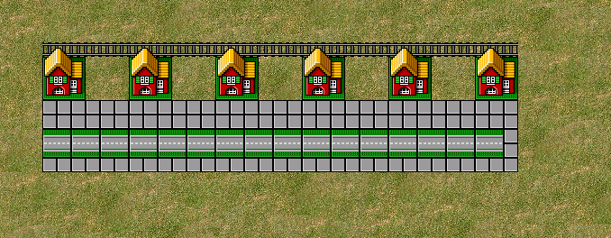

# openLegoLoco



A game project using raylib.

## Assets

Sprites are temporarily borrowed from [MartinSStewart/Lego-Loco-Remake](https://github.com/MartinSStewart/Lego-Loco-Remake) and will be replaced with original assets.

## Dependencies (Linux)

```bash
sudo apt install libx11-dev libxrandr-dev libxi-dev libxinerama-dev libxcursor-dev
sudo apt install libgl1-mesa-dev libglu1-mesa-dev
```

## Clone

```bash
git clone --recursive https://github.com/GuusSeldenthuis/openLegoLoco.git
```

Or if already cloned without submodules:
```bash
git submodule update --init --recursive
```

## Build

### Make
```bash
make
```

### CMake
```bash
cmake -B build -DCMAKE_BUILD_TYPE=Release
cmake --build build
```

Both options automatically build raylib from source on first run.

## Run

```bash
./bin/lego_loco
# or
make run
```

## Clean

```bash
make clean      # Remove only the game binary
make clean-all  # Remove binary and rebuild raylib
```

## Acknowledgments

Thanks to [shinyquagsire23](https://github.com/shinyquagsire23) for creating [rf-extract.py](https://gist.github.com/neofelis2X/fd244e45eafef0c90a1eafed9041abd3) and [neofelis2X](https://github.com/neofelis2X) for making it compatible with Python 3.

## Disclaimer

This is a fan-made, non-commercial project created for educational and entertainment purposes only. "LEGO" and "LEGO Loco" are trademarks of the LEGO Group, which does not sponsor, authorize, or endorse this project. Any original game assets used are the property of their respective owners. This project is not affiliated with or endorsed by the LEGO Group in any way.
